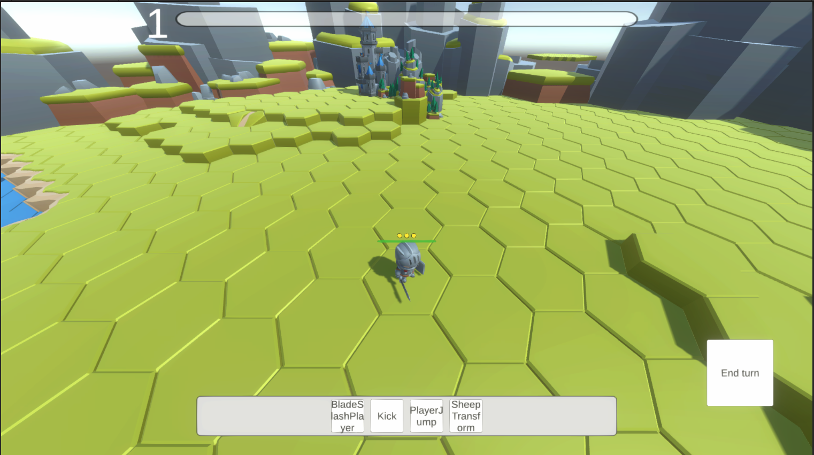
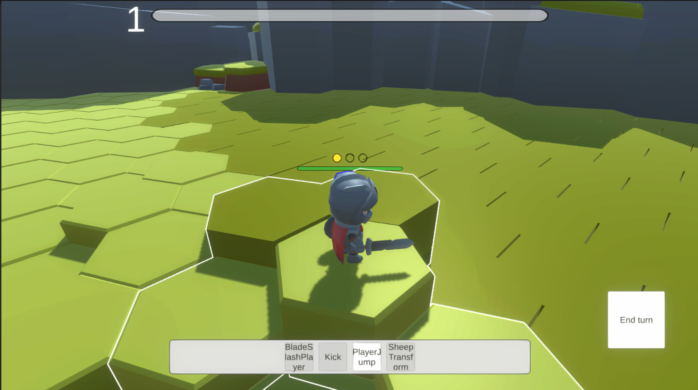
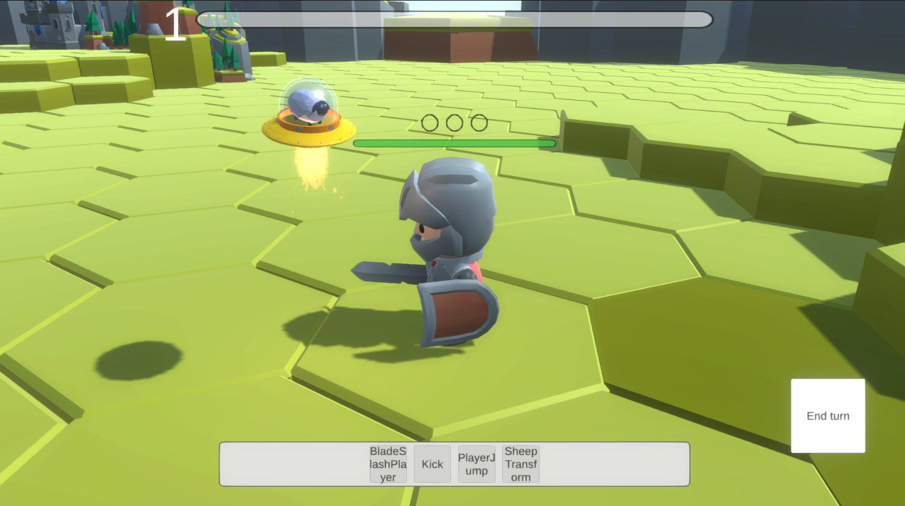
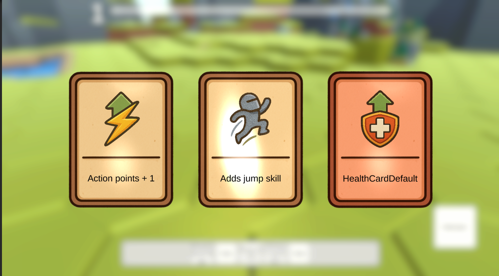
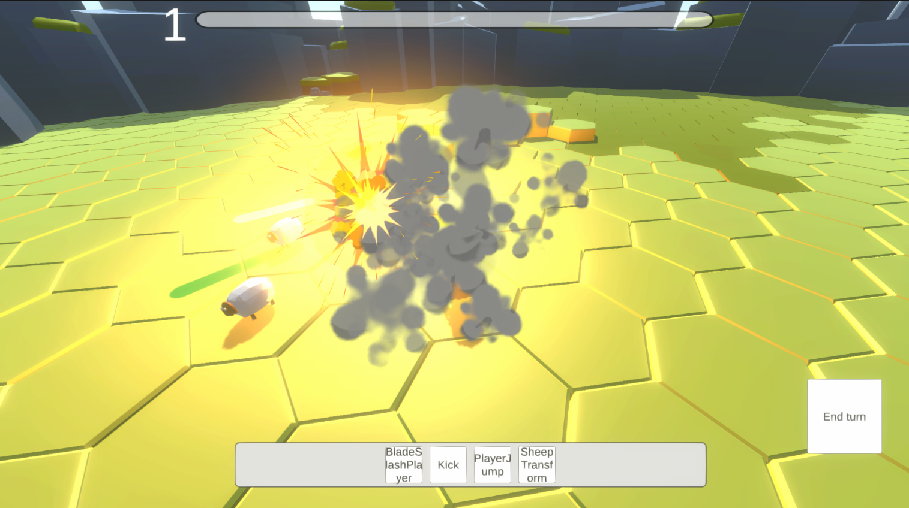
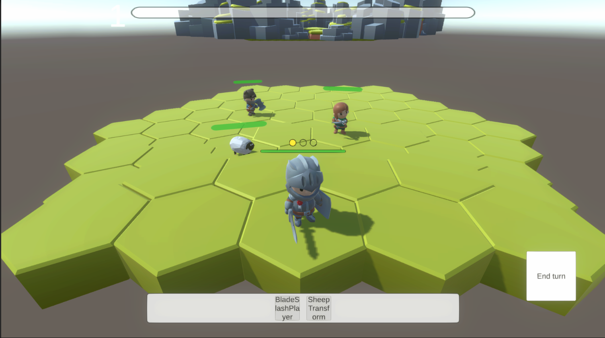

# Tactical Hex RPG — Prototype

## Description
A 3D tactical RPG prototype built in Unity, featuring a **hexagonal grid with multi-level terrain**.  
The game focuses on **tactical positioning**, **height-based mechanics**, and **AI state logic**.  
It’s a sandbox-style prototype that showcases gameplay systems typical for turn-based tactical or strategy RPGs.

---

## Features

- **Hex-based pathfinding with multi-level support** — Units move and act depending on elevation and visibility.
- **Height-influenced gameplay** — Movement range, damage, and skills change with terrain height.
- **State Machine–driven AI** — Enemies dynamically switch between patrol, chase, attack, and idle states.  
- **Upgrade and leveling system** — Characters gain XP and improve abilities based on experience.  
- **Open-world structure** — The world can be expanded infinitely with no scene transitions.  
- **Flexible strategy-style camera** — Move, rotate, and zoom freely.  
  - Zooming in gives a close third-person view.  
  - Zooming out transitions to a top-down tactical overview.  
- **Prototype UI** — Turn order, action menus, and unit stats panels.  
- **Optimized grid management** — Uses object pooling and caching for grid tiles and entities.  
- **Debug visualization tools** — Highlights movement paths, tile ranges, and AI states in real time.
- **Big skill and behavior variety** — Units have different movement patterns, abilities, and decision logic based on their role and environment.  

---

## Technologies and Tools

- **Unity Engine (C#)**
- **ScriptableObjects** — for data-driven unit, ability, and item definitions  
- **Coroutines & async/await** — to manage turn order and delays smoothly  
- **Custom pathfinding algorithm** — adapted for multi-height hex tiles  
- **Gizmos and editor tools** — for visual debugging and grid visualization  

---

## Screenshots

---

## Video Demos

- [Main Gameplay Demo](https://youtu.be/_jFIeJNdA7M)  
- [Additional Features Demo](https://youtu.be/04SHf5_Pkho)  

---

##  Notes

This project was developed as a **technical and design prototype** for studying tactical gameplay systems — focusing on AI, Skills, and scalable world design.  
It’s not a finished game, but a demonstration of mechanics and code architecture for potential future development.
